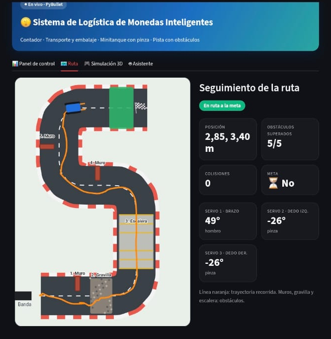
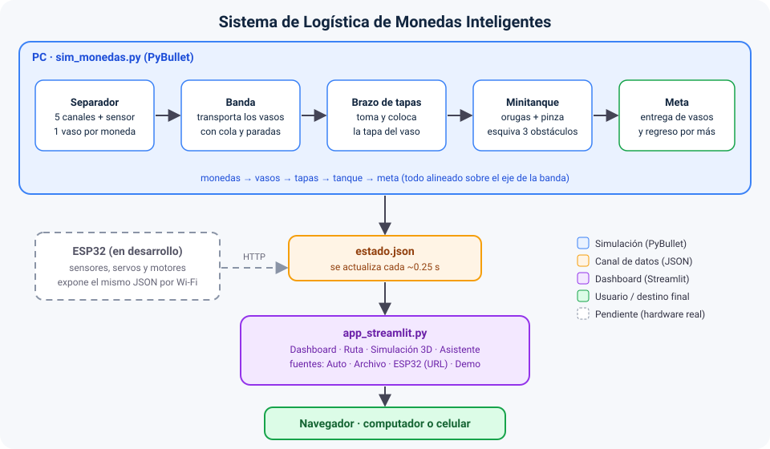

<div align="center">

[](#)

*Universidad Militar Nueva Granada · Microcontroladores*

[](#)

[](#)
[](#)
[](#)
[](#)
[](#)

</div>


## ✨ ¿Qué hace este proyecto?

Un sistema **logístico de monedas colombianas** que se simula en **PyBullet** y se monitorea desde un **dashboard web en Streamlit** (computador o celular). Las monedas se separan por tamaño, se cuentan, se guardan en vasos (**un vaso por denominación**), se tapan con un brazo robótico y un **minitanque con pinza** las lleva por una pista con **3 obstáculos** hasta la meta. El hardware real se controlará con una **ESP32**.

| 🪙 Separador | 🧃 Vasos y banda | 🦾 Brazo de tapas | 🚜 Minitanque |
| --- | --- | --- | --- |
| Clasifica por diámetro y cuenta cada moneda con un sensor | Cada vaso se llena con las monedas de **un solo valor** y viaja por la banda | Toma una tapa del almacén y sella el vaso | Recoge cada vaso, esquiva los obstáculos y lo entrega en la meta |

> 💡 En este grupo el **minitanque con orugas y pinza reemplaza al dron** del enunciado general.

### 📊 Estado del proyecto

| Módulo | Estado |
| --- | --- |
| Separador y conteo de monedas (simulado) | ✅ Listo |
| Vasos por denominación y banda transportadora (simulado) | ✅ Listo |
| Brazo de tapas (simulado) | ✅ Listo |
| Minitanque con pinza y pista con 3 obstáculos (simulado) | ✅ Listo |
| Dashboard en Streamlit (KPIs, gráficas, ruta, 3D, asistente) | ✅ Listo |
| Asistente con respuesta por texto y voz del navegador | ✅ Listo |
| Firmware de la ESP32 y conexión al dashboard | 🚧 En desarrollo |
| Construcción mecánica y electrónica real | 🚧 En desarrollo |
| Control del minitanque **por voz** | 🚧 Pendiente |


## 📑 Contenido

- [🪙 Monedas y dimensiones](#-monedas-y-dimensiones)
- [📸 Capturas](#-capturas)
- [🎥 Video de funcionamiento](#-video-de-funcionamiento)
- [📐 Arquitectura general](#-arquitectura-general)
- [📁 Estructura del repositorio](#-estructura-del-repositorio)
- [⚙️ Requisitos](#%EF%B8%8F-requisitos) (librerías de Python y hardware)
- [▶️ Cómo correrlo](#%EF%B8%8F-c%C3%B3mo-correrlo)
- [📡 Formato de datos (`estado.json`)](#-formato-de-datos-estadojson)
- [🔌 Integración con la ESP32](#-integraci%C3%B3n-con-la-esp32)
- [🧩 Explicación del código, bloque por bloque](#-explicaci%C3%B3n-del-c%C3%B3digo-bloque-por-bloque)
- [🧠 Conceptos clave](#-conceptos-clave)
- [🛠️ Solución de problemas](#%EF%B8%8F-soluci%C3%B3n-de-problemas)
- [⚠️ Simplificaciones de la simulación](#%EF%B8%8F-simplificaciones-de-la-simulaci%C3%B3n)
- [👤 Autor](#-autor)


## 🪙 Monedas y dimensiones

El sistema usa solo monedas colombianas de la **serie 2012** (50, 100, 200, 500 y 1.000 pesos). El separador es una rampa con huecos de ancho creciente: cada moneda sale por el primer hueco en el que cabe.

| Moneda | Diámetro | Espesor | Peso | Ancho de hueco (diseño) |
| --- | --- | --- | --- | --- |
| $50 | 17,0 mm | 1,30 mm | 2,00 g | 17,4 mm |
| $100 | 20,3 mm | 1,50 mm | *por medir* ⚠️ | 20,7 mm |
| $200 | 22,4 mm | 1,70 mm | 4,61 g | 22,8 mm |
| $500 | 23,7 mm | 2,05 mm | 7,14 g | 24,1 mm |
| $1.000 | 26,7 mm | 2,70 mm | 9,95 g | canal final (≥ 27,5 mm) |

> ⚠️ El peso de la moneda de $100 es **provisional** (3,5 g en el código). Pésala con una balanza y corrígelo.
>
> 💡 La pareja más delicada es **$200 vs $500**: solo se diferencian 1,3 mm, por eso el hueco se diseña con una holgura de unos 0,4 mm sobre el diámetro y la simulación agrega una tolerancia de fabricación de ±0,10 mm.

El **peso** que muestra el dashboard es **estimado**: cantidad de cada denominación × su peso nominal. No hay celda de carga.


## 📸 Capturas

> Agrega tus capturas en `docs/imagenes/` con estos nombres (o cambia las rutas).

| <br>Simulación en PyBullet | <br>Dashboard en computador |
| --- | --- |
| <br>Seguimiento de la ruta | <br>Dashboard en el celular |


## 🎥 Video de funcionamiento

> GitHub no reproduce videos `.mp4` alojados en el repo dentro del README, así que se deja como enlace.

- ▶️ [**Funcionamiento del sistema**](docs/videos/Video%20Funcionamiento.mp4) — demo completa: conteo, tapas, entrega y dashboard.

**GIF de funcionamiento:**

[](docs/videos/GIF%20FUNCIONAMIENTO.gif)


## 📐 Arquitectura general

[](docs/imagenes/diagrama-arquitectura.svg)

| Símbolo | Significado |
| --- | --- |
| **→** | Relación de un solo sentido: los datos fluyen en esa dirección |
| 🟦 **Caja azul** | Simulación en PyBullet (`sim_monedas.py`) y sus módulos |
| 🟧 **Caja naranja** | Canal de datos: el archivo `estado.json` (o el mismo JSON por HTTP desde la ESP32) |
| 🟪 **Caja morada** | Dashboard (`app_streamlit.py`) |
| 🟩 **Caja verde** | Destino final: el navegador del computador o del celular |
| ⬜ **Caja punteada** | Pendiente: hardware real con ESP32 |

> 💡 **Idea clave:** la simulación y el dashboard **no se hablan directamente**. Se comunican por un contrato simple: un JSON (`estado.json`). Por eso el dashboard puede leer el mismo formato desde la ESP32 cuando el hardware esté listo, sin cambiar nada más.


## 📁 Estructura del repositorio

```
Logistica-de-Monedas-Inteligentes/
├── sim_monedas.py              # Simulación PyBullet (separador, banda, brazo, tanque, pista)
├── app_streamlit.py            # Dashboard web (PC y celular)
├── minitanque.html             # Simulación 3D interactiva (Three.js), se incrusta en el dashboard
├── requirements.txt            # Dependencias de Python
├── esp32_firmware/             # (pendiente) firmware de la ESP32
├── docs/
│   ├── imagenes/
│   │   ├── diagrama-arquitectura.svg
│   │   ├── Simulacion PyBullet.png
│   │   ├── Dashboard.png
│   │   ├── Ruta.png
│   │   └── Dashboard Celular.png
│   └── videos/
│       ├── Video Funcionamiento.mp4
│       └── GIF FUNCIONAMIENTO.gif
└── README.md
```

> 📝 `estado.json` lo **genera** la simulación al correr. Conviene agregarlo al `.gitignore`.


## ⚙️ Requisitos

[](#)

- ✅ Python 3.10+
- ✅ Un navegador (para el dashboard; el celular debe estar en la **misma red Wi-Fi** que el computador)
- ✅ Internet solo para la pestaña **Simulación 3D** (carga la librería Three.js)
- 🚧 Para el hardware real: una ESP32, Arduino IDE con el paquete de placas **esp32 by Espressif Systems**, sensores (CNY70 o de barrera), servos y motores

**Instalación de dependencias de Python:**

```
pip install -r requirements.txt
```

### 📦 Librerías de Python: qué hacen y por qué se eligieron

| Librería | Para qué sirve | Dónde se usa | Por qué esta y no otra |
| --- | --- | --- | --- |
| **PyBullet** (`pybullet`) | Motor de física: crea los cuerpos (monedas, vasos, banda, tanque, brazo), simula gravedad y contactos y dibuja la escena en 3D | `sim_monedas.py` | Es el motor que pide el enunciado, corre en un computador normal y permite construir los modelos directamente desde código, sin archivos URDF |
| **Streamlit** (`streamlit`) | Crea el dashboard web: pestañas, tarjetas, gráficas, chat y actualización automática | `app_streamlit.py` | Es lo que pide el enunciado y convierte un script de Python en una página que también se ve en el celular, sin escribir HTML ni JavaScript |
| **Altair** (`altair`) | Gráficas de cantidad por denominación y valor acumulado | `app_streamlit.py` | Ya viene como dependencia de Streamlit y genera gráficas interactivas con pocas líneas |
| **Pandas** (`pandas`) | Tablas de datos para las gráficas y el detalle por moneda | `app_streamlit.py` | Es el formato que Streamlit y Altair esperan para graficar |
| **json, math, argparse, random, time, pathlib, urllib, base64, re** (módulos estándar) | Escribir/leer `estado.json`, geometría, argumentos de la terminal, tolerancias aleatorias, tiempos, archivos, lectura por HTTP, imagen SVG de la ruta y reglas del asistente | Ambos | Vienen incluidos con Python; no requieren instalación |

**Ver `requirements.txt` comentado**

```
pybullet        # simulación física (sim_monedas.py)
streamlit>=1.37 # dashboard; 1.37+ por st.fragment(run_every=...) (app_streamlit.py)
pandas          # tablas para las gráficas (app_streamlit.py)
altair          # gráficas (app_streamlit.py)
```


## ▶️ Cómo correrlo

1. **Instala** las dependencias (`pip install -r requirements.txt`).

2. **Terminal 1 — simulación** (desde la carpeta del repositorio):

```
python sim_monedas.py
```

3. **Terminal 2 — dashboard:**

```
streamlit run app_streamlit.py
```

   Se abre en el navegador (normalmente `http://localhost:8501`). **No** lo ejecutes con `python app_streamlit.py`: Streamlit debe lanzarse con `streamlit run`.

4. **Para verlo en el celular** (misma red Wi-Fi):

```
streamlit run app_streamlit.py --server.address 0.0.0.0
```

   Y en el celular abre `http://IP-DEL-COMPUTADOR:8501` (la IP se ve con `ipconfig`, línea "Dirección IPv4"). Si Windows pregunta por el firewall, permite el acceso en redes privadas.

> 💡 Si la simulación no está corriendo, el dashboard (fuente **Auto**) muestra **datos de demostración**, así puedes probarlo solo.

### 🔧 Opciones de la simulación

| Opción | Valor por defecto | Descripción |
| --- | --- | --- |
| `--sin-gui` | — | Corre sin ventana gráfica (pruebas) |
| `--monedas` | `20` | Cantidad de monedas a procesar |
| `--cada` | `0.8` | Segundos entre una moneda y la siguiente |
| `--velocidad` | `1.0` | Factor de velocidad de la ventana (`3` = tres veces más rápida) |
| `--max-tiempo` | `900` | Tiempo máximo simulado, en segundos |
| `--semilla` | — | Semilla aleatoria para repetir exactamente la misma corrida |

Ejemplo: `python sim_monedas.py --monedas 12 --velocidad 3`

### 🖥️ Fuentes de datos del dashboard

| Fuente | Qué hace |
| --- | --- |
| **Auto** | Usa `estado.json` si la simulación lo está actualizando; si no, modo demo |
| **Archivo** | Lee `estado.json` (ruta configurable en la barra lateral) |
| **ESP32 (URL)** | Lee un JSON con el mismo formato desde una dirección, por ejemplo `http://192.168.1.50/datos` |
| **Demo** | Datos de ejemplo, sin simulación |

La barra lateral también permite **cambiar el peso aproximado de cada moneda**, y la pestaña **🤖 Asistente** responde preguntas y puede **leer la respuesta en voz alta**.


## 📡 Formato de datos (`estado.json`)

JSON que la simulación escribe unas 4 veces por segundo (de forma atómica, para que el dashboard nunca lea un archivo a medias). Estos son los campos principales (valores de ejemplo):

```json
{
  "t": 142.5,
  "origen": "pybullet",
  "cuentas": {"50": 3, "100": 2, "200": 7, "500": 5, "1000": 3},
  "valor_total": 7650,
  "monedas_contadas": 20,
  "precision": 1.0,
  "vasos_embalados": 5,
  "vasos_entregados": 2,
  "total_vasos": 5,
  "vasos": [
    {"denom": 200, "n": 7, "valor": 1400, "tapado": true, "entregado": true}
  ],
  "brazo_tapas": {"estado": "REPOSO", "tapas_puestas": 5},
  "tanque": {"x": 1.9, "y": 1.2, "yaw": 1.57, "estado": "EN_RUTA",
             "obstaculos_superados": 2, "colisiones": 0},
  "meta_alcanzada": false,
  "trayectoria": [[1.8, -0.8], [1.8, 0.2]],
  "serie": [[0.8, 50, 1], [1.6, 250, 2]],
  "escenario": {"muros": [], "camino": [], "meta": []}
}
```

| Campo | Qué es |
| --- | --- |
| `cuentas` | Cantidad contada por cada denominación |
| `vasos` | Un vaso por denominación: cuántas monedas lleva, su valor, si ya tiene tapa y si ya fue entregado |
| `tanque.estado` | Estado de la máquina de estados del tanque (`ESPERANDO_VASO`, `ACERCARSE`, `ALINEAR`, `AGARRAR`, `EN_RUTA`, `SOLTAR`, `REGRESAR`, `FIN`) |
| `trayectoria` | Puntos recorridos por el tanque en el viaje actual (la línea naranja del mapa) |
| `serie` | Historial `[tiempo, valor, monedas]` para la gráfica de valor acumulado |
| `escenario` | Posición de muros, camino y meta, para que el dashboard dibuje la misma pista |

> 💡 Como la `trayectoria` y la `serie` viajan **dentro** del JSON, un celular que abra el dashboard tarde ve igualmente todo el historial.


## 🔌 Integración con la ESP32

> 🚧 **En desarrollo.** Esta sección describe el plan; el firmware todavía no está en el repositorio.

La ESP32 reemplazará la parte simulada: leerá los sensores de cada canal, manejará los motores y servos y publicará el **mismo JSON** de arriba por Wi-Fi. El dashboard ya está listo para leerlo con la fuente **ESP32 (URL)**.

| Parte | Hardware previsto |
| --- | --- |
| Conteo por canal | Un sensor por canal (CNY70 o de barrera) en pines **ADC1** de la ESP32 (los ADC2 no funcionan bien con el Wi-Fi activo) |
| Banda y tanque | Motores DC con puente H (orugas diferenciales) |
| Pinza y brazos | Servos |
| Comunicación | Wi-Fi (HTTP con JSON), Bluetooth o ESP-NOW |


## 🧩 Explicación del código, bloque por bloque

### 1️⃣ `sim_monedas.py` — la simulación

**🪙 Clasificación por ancho de hueco**

```python
ANCHOS_HUECOS = [17.4, 20.7, 22.8, 24.1]   # mm; el canal de $1000 es el final

def clasificar(diametro_mm):
    for i, ancho in enumerate(ANCHOS_HUECOS):
        if diametro_mm < ancho:
            return DENOMS[i]
    return DENOMS[-1]
```

Imita la rampa física: la moneda sale por el primer hueco en el que cabe. Antes de clasificar, el diámetro de cada moneda se perturba ±0,10 mm (`TOLERANCIA_MM`) para reproducir la tolerancia real de fabricación.

**📏 Sensor y llenado del vaso**

```python
if not info["contada"] and z < Z_SENSOR:
    info["contada"] = True
    cuentas[info["canal"]] += 1
if z < Z_ENTRADA_VASO:                      # la moneda cae dentro del vaso
    v = vaso_de[info["canal"]]
    v["n"] += 1
    revelar_capa(v["id"], v["denom"], v["n"] - 1)
    p.removeBody(cid)
```

El marco rojo del separador es el "sensor": cuando la moneda lo cruza, se cuenta. Más abajo, al llegar al vaso, se retira de la simulación y se **revela una capa de monedas** dentro del vaso, así cada vaso se ve más o menos lleno según cuántas monedas de su valor hayan llegado.

**🧃 Un vaso por denominación**

```python
for x, d in zip(X_CANALES, DENOMS):
    vid = crear_vaso([x, 0.0, Z_TOPE_BANDA + H_VASO / 2 + 0.001], d)
    vasos.append({"id": vid, "denom": d, "n": 0, "valor": 0, "estado": "LLENANDO", ...})
```

Los 5 vasos arrancan sobre la banda, justo debajo de su canal. Al terminar el conteo, los que quedaron sin monedas se retiran y los demás empiezan a viajar.

**➡️ Banda con cola y paradas**

```python
meta_x = X_FIN_BANDA if v["tapado"] else X_TAPA
if limite_adelante is not None:
    meta_x = min(meta_x, limite_adelante)
if x >= meta_x - 0.003:
    p.resetBaseVelocity(v["id"], [0, 0, 0], [0, 0, 0])
else:
    p.resetBaseVelocity(v["id"], [V_BANDA, 0, 0], [0, 0, 0])
limite_adelante = meta_x - SEP_VASOS
```

Cada vaso avanza hasta su parada: la **estación del brazo** si aún no tiene tapa, o el **final de la banda** si ya la tiene. Un vaso nunca pasa al que va adelante (`SEP_VASOS`), así se forma una fila ordenada.

**🦾 Brazo de tapas (máquina de estados)**

```python
elif brazo_estado == "GIRAR_A_VASO":
    if brazo_alcanzo(brazo, yaw=YAW_VASO) or t - t_brazo > 5:
        brazo_mover(brazo, bajar=SLIDE_BAJO)
        brazo_estado, t_brazo = "BAJAR_A_VASO", t
```

El ciclo completo es: `REPOSO → BAJAR_A_TAPA → AGARRAR_TAPA → SUBIR_CON_TAPA → GIRAR_A_VASO → BAJAR_A_VASO → SOLTAR_TAPA → SUBIR_SIN_TAPA → VOLVER`. Cada paso espera a que la articulación llegue a su objetivo (o a un tiempo máximo, para no quedarse trabado). Tiene tres movimientos: giro, bajada y pinza.

**🚜 Control diferencial de las orugas**

```python
def mover(tanque, v, w):
    vl = v - w * SEP_ORUGAS / 2
    vr = v + w * SEP_ORUGAS / 2
    for j in range(3):
        p.setJointMotorControl2(tanque, j, p.VELOCITY_CONTROL,
                                targetVelocity=vl / R_RUEDA, force=FUERZA_RUEDA)
    for j in range(3, 6):
        p.setJointMotorControl2(tanque, j, p.VELOCITY_CONTROL,
                                targetVelocity=vr / R_RUEDA, force=FUERZA_RUEDA)
```

Cada oruga son 3 ruedas acopladas. Con una velocidad lineal `v` y una angular `w` se calcula la velocidad de cada lado: si un lado va más rápido que el otro, el tanque gira.

**🧭 Ir a un punto**

```python
err = norm_ang(math.atan2(dy, dx) - yaw)
w = max(-W_MAX, min(W_MAX, 2.5 * err))
if abs(err) < 0.6:
    v = min(V_MAX, 1.5 * dist) * max(0.0, math.cos(err)) ** 2
else:
    v = 0.0
```

Un controlador proporcional: gira hacia el punto y solo avanza cuando ya está bien orientado; además frena al acercarse. La ruta son varios puntos que **rodean** los 3 obstáculos.

**🔁 Estados del tanque**

`ESPERANDO_VASO → ACERCARSE → ALINEAR → AGARRAR → EN_RUTA → SOLTAR → REGRESAR → …` y, al entregar el último vaso, `FIN`. Cada vaso se deja en un sitio distinto de la meta (`ruta_entrega`), y el tanque regresa por el mismo camino (`ruta_regreso`) para buscar el siguiente.

**💾 Escritura atómica del JSON**

```python
tmp = ARCHIVO_ESTADO.with_suffix(".tmp")
tmp.write_text(json.dumps(estado, ensure_ascii=False), encoding="utf-8")
os.replace(tmp, ARCHIVO_ESTADO)
```

Escribe primero en un archivo temporal y luego lo reemplaza de golpe, para que el dashboard nunca lea un JSON a medias.

### 2️⃣ `app_streamlit.py` — el dashboard

**📥 Lectura del estado con respaldo en demo**

```python
est, edad = archivo()
if origen == "Auto" and edad > FRESCURA_S:
    return demo_estado(), "demo", "No hay simulación activa: mostrando datos de demostración."
```

En modo **Auto**, si `estado.json` no existe o lleva más de 10 s sin actualizarse, el dashboard muestra datos de demostración y avisa con una etiqueta. Así siempre hay algo que ver.

**🔄 Actualización automática**

```python
every = st.session_state.get("refresco", 1)
return st.fragment(run_every=every)(fn) if hasattr(st, "fragment") else fn
```

Cada pestaña es un *fragmento* que se vuelve a leer sola cada 1–5 s, sin recargar toda la página.

**⚖️ Peso estimado**

```python
peso = sum(pesos[d] * n for d, n in cuentas.items())
```

Cantidad de cada denominación por su peso nominal, editable en la barra lateral.

**🗺️ Mapa de la ruta**

La pista se dibuja como una imagen **SVG** (carretera, obstáculos, meta, trayectoria naranja y el tanque rotado según su orientación) incrustada en la página. Se redibuja con cada actualización y se adapta al ancho de la pantalla.

**🤖 Asistente por reglas y voz**

```python
if re.search(r"tapa|brazo", t):
    ...
if re.search(r"peso|pesa|gramo", t):
    ...
```

El asistente busca palabras clave en la pregunta (valor total, monedas por denominación, peso, vasos, tapas, tanque, precisión) y responde con los datos actuales. La voz usa la **síntesis de voz del navegador** (`SpeechSynthesisUtterance`, español de Colombia): no instala nada, pero funciona solo al **pulsar el botón** 🔊.

### 3️⃣ `minitanque.html` — vista 3D

Simulación 3D interactiva hecha con Three.js que se incrusta en la pestaña **🎮 Simulación 3D** del dashboard. Es independiente de `estado.json`: sirve como demostración visual.


## 🧠 Conceptos clave

**🧱 PyBullet y cuerpos multi-articulados**

PyBullet es un motor de física. Los objetos con partes móviles (el tanque y el brazo) son *multi-cuerpos*: una base y una lista de eslabones unidos por articulaciones (de giro o deslizantes) que se mueven con motores de posición o de velocidad.

**📏 Separación por diámetro**

Una rampa con huecos de ancho creciente deja caer cada moneda por el primero en el que cabe. Funciona porque el diámetro crece con el valor (17 < 20,3 < 22,4 < 23,7 < 26,7 mm). Lo crítico es la holgura de cada hueco frente a la tolerancia de las monedas.

**🔦 Sensor óptico (CNY70)**

Un LED infrarrojo y un fototransistor en un solo encapsulado: al pasar una moneda metálica cambia la luz reflejada y la ESP32 lo lee como un pulso por moneda. En la simulación se representa con un plano a cierta altura que "cuenta" al cruzarlo.

**🔁 Máquina de estados**

Forma de organizar un proceso en pasos: cada estado hace una cosa y pasa al siguiente cuando se cumple una condición. Aquí la usan el brazo de tapas y el tanque.

**🚜 Dirección diferencial**

Un vehículo de dos orugas gira por la **diferencia** de velocidad entre sus lados: igual velocidad, avanza recto; velocidades distintas, gira; velocidades opuestas, gira sobre su eje.

**📡 `estado.json` como contrato**

El dashboard no depende de cómo se produce el dato (simulación o ESP32), solo de que el JSON tenga ese formato. Eso permite cambiar la fuente sin tocar la visualización.

**🔌 ADC1 vs ADC2 en la ESP32**

Con el Wi-Fi activo, los canales ADC2 dejan de funcionar bien, por eso las entradas analógicas de los sensores deben ir en pines **ADC1** (GPIO 32–39).

**⏱️ Fragmentos de Streamlit (`st.fragment`)**

Permiten que una parte de la página se actualice sola cada cierto tiempo sin volver a ejecutar todo el script.


## 🛠️ Solución de problemas

| Problema | Posible solución |
| --- | --- |
| `ModuleNotFoundError` (`altair`, `streamlit`, `pybullet`, `pandas`) | Ejecuta `pip install -r requirements.txt` |
| Después de instalar sigue sin encontrar el módulo | Usa el mismo Python para ambos: `python -m pip install -r requirements.txt` y `python -m streamlit run app_streamlit.py` |
| Al correr `python app_streamlit.py` salen avisos o no abre | Debe ejecutarse con `streamlit run app_streamlit.py` |
| `pybullet` falla al instalar en Windows | Suele pedir las herramientas de compilación de C++ de Visual Studio, o probar con otra versión de Python (3.10–3.12) |
| El dashboard dice "Modo demo" | Corre `python sim_monedas.py` **en la misma carpeta**; `estado.json` se crea ahí. También puedes elegir la fuente **Archivo** |
| El celular no abre el dashboard | Misma red Wi-Fi, lanzar con `--server.address 0.0.0.0` y permitir el puerto **8501** en el firewall |
| La pestaña 🎮 está vacía | Verifica que `minitanque.html` esté junto a `app_streamlit.py` y que haya internet |
| El asistente no habla | Pulsa el botón 🔊 (los navegadores exigen un clic) y revisa que el navegador tenga una voz en español |
| La simulación va muy lenta | Usa `--velocidad 3` o menos monedas con `--monedas 12` |
| El tanque gira mal sobre su eje | Ajusta la fricción lateral de las ruedas (`lateralFriction`) o `FUERZA_RUEDA` en `sim_monedas.py` |


## ⚠️ Simplificaciones de la simulación

- La separación por huecos se **calcula** con los anchos; la moneda se suelta directamente sobre su canal (no se simula la rodadura por la rampa).
- Al llegar al vaso, la moneda se retira de la simulación y se apila una **capa visual** (máximo 8 capas visibles). El conteo real es el del JSON.
- Las monedas se dibujan a **escala ×3** para que se vean y no atraviesen el piso por ser tan delgadas.
- Las **tapas** del brazo y del vaso son visuales (aparecen y desaparecen).
- La sujeción del vaso por el tanque se hace con un **constraint fijo**.
- La carretera, las líneas y los adornos son solo visuales (sin colisión).


## 👤 Autor

**[Tu nombre]** · Universidad Militar Nueva Granada · Microcontroladores

[](#)
